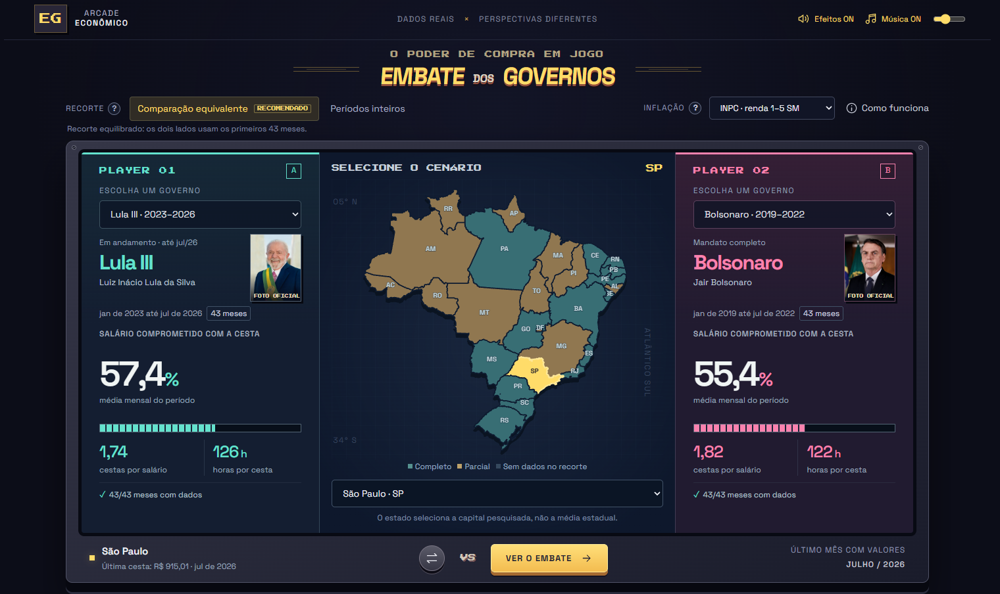
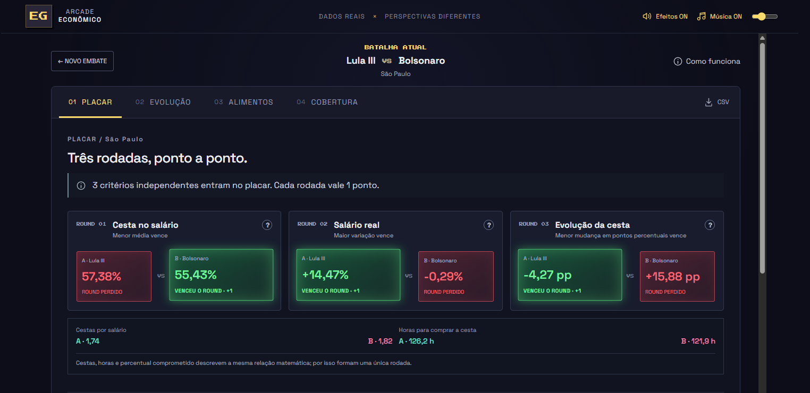
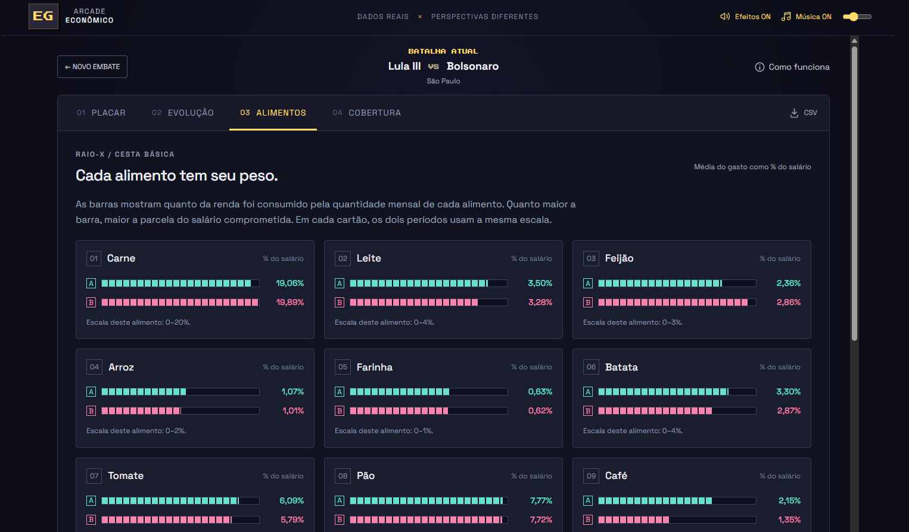

<div align="center">

# 🕹️ Embate dos Governos

### Cesta básica, salário mínimo e poder de compra em uma arena de comparação

Ferramenta interativa para comparar períodos presidenciais brasileiros utilizando dados econômicos reais, recortes por capital, inflação, evolução da cesta básica e ganho real do salário mínimo.

</div>

## Sobre o projeto

O **Embate dos Governos** transforma séries econômicas extensas em uma experiência visual inspirada nos jogos de luta dos anos 1990.

O usuário escolhe dois períodos presidenciais, uma capital e um índice de inflação. A ferramenta calcula os indicadores, compara a evolução do poder de compra, detalha os alimentos da cesta básica e apresenta um placar com os critérios vencidos por cada lado.

O projeto não utiliza inteligência artificial para interpretar os resultados. Todas as análises são produzidas por regras matemáticas transparentes e executadas diretamente no navegador.

## Experiência e funcionalidades

### 1. Entrada na arena


A primeira tela apresenta rapidamente a proposta da ferramenta antes de iniciar a experiência. O usuário pode entrar com música e efeitos sonoros ou selecionar a opção sem som.

Essa etapa também permite que o navegador libere o áudio somente após uma interação do usuário, evitando reprodução automática sem consentimento.

### 2. Seleção do embate e do cenário



Na arena principal, o usuário configura todos os elementos da comparação:

- Escolhe o período presidencial de cada lado.
- Seleciona uma capital diretamente no mapa do Brasil.
- Alterna entre INPC e IPCA.
- Define se deseja uma comparação equivalente ou os períodos inteiros.
- Visualiza previamente o percentual médio do salário comprometido pela cesta.
- Consulta quantas cestas cabem no salário mínimo e quantas horas de trabalho seriam necessárias para comprar uma cesta.
- Confere a cobertura mensal disponível para cada período.

As cores do mapa informam se a localidade possui cobertura completa, parcial ou insuficiente para o recorte selecionado. A seleção representa a capital pesquisada, e não uma média de todo o estado.

#### Comparação equivalente

A comparação equivalente usa, nos dois lados, a duração do período mais curto, sempre a partir do primeiro mês. Essa é a opção recomendada para o embate direto porque evita colocar, por exemplo, um governo de 16 meses contra outro de 48 meses.

#### Períodos inteiros

A opção de períodos inteiros utiliza todos os meses disponíveis de cada lado. Ela é útil para observar a trajetória completa de cada governo, mas pode comparar intervalos de tamanhos diferentes.

### 3. Placar por indicadores



O placar divide a comparação em três rodadas independentes. Cada critério válido concede um ponto ao período com o melhor resultado.

| Rodada | Indicador | Como é interpretado |
|---|---|---|
| 01 | Cesta no salário | Mede o percentual médio do salário mínimo consumido pela cesta. Menor é melhor. |
| 02 | Salário real | Compara o reajuste nominal do salário com a inflação acumulada. Maior é melhor. |
| 03 | Evolução da cesta | Mede a mudança do peso da cesta no salário entre o início e o fim do recorte. Menor é melhor. |

O vencedor de cada rodada recebe destaque verde, brilho e expansão visual. O lado com pior resultado aparece em vermelho. Os botões de ajuda explicam o significado de cada indicador e o motivo do critério utilizado.

Cestas por salário, horas de trabalho e percentual comprometido representam a mesma relação matemática. Por isso, esses três valores formam uma única rodada e não são contabilizados como três pontos diferentes.

### 4. Inflação, ganho real e resultado final


O detalhamento de inflação mostra como o aumento nominal do salário se comportou depois de descontada a inflação do mesmo intervalo.

Para cada lado são apresentados:

- Aumento nominal do salário mínimo.
- Inflação acumulada pelo índice selecionado.
- Ganho ou perda real de poder de compra.

O resultado final aparece somente depois das rodadas. A área verde avança conforme a quantidade de critérios conquistados, enquanto o centro apresenta o placar definitivo do recorte.

O ganho real é calculado por fatores:

```text
ganho real = (salário final / salário de referência)
             / (índice final / índice de referência) - 1
```

### 5. Raio-X dos alimentos



O Raio-X abre a cesta básica e mostra quanto cada alimento comprometeu do salário mínimo em cada período.

Cada cartão utiliza uma escala própria, compartilhada pelos dois lados, permitindo comparar visualmente itens como carne, leite, feijão, arroz, farinha, batata, tomate, pão e café.

Quanto maior a barra, maior foi a parcela do salário necessária para comprar a quantidade mensal daquele alimento prevista na cesta da localidade.

## Outras áreas da análise

Além das telas apresentadas, a ferramenta possui:

- **Evolução:** gráficos mensais da cesta, do salário e do percentual de renda comprometido.
- **Cobertura:** visualização dos meses existentes, lacunas da base e observações de auditoria.
- **Exportação CSV:** download dos dados do recorte selecionado.
- **Como funciona:** explicação da metodologia, das fontes e das limitações da comparação.
- **Controles de áudio:** música 16-bit, efeitos sonoros e volume configuráveis.

## Cobertura dos dados

A base tratada reúne:

- 27 capitais brasileiras e Macaé.
- 6.783 observações mensais.
- Valores da cesta básica e de seus componentes.
- Histórico do salário mínimo federal.
- Séries mensais do INPC e do IPCA.
- Dados válidos até julho de 2026.

Agosto de 2026 aparece em algumas exportações originais, mas sem valores preenchidos para todas as localidades. Por isso, julho de 2026 permanece como a última competência válida da versão publicada.

As lacunas não são preenchidas com zero. As médias da cesta só são exibidas quando todos os meses do recorte possuem dados. Localidades com séries menores, como Boa Vista, são destacadas para evitar uma comparação incompleta ou enganosa.

## INPC e IPCA

O **INPC** é o índice padrão do projeto por acompanhar famílias assalariadas com rendimento entre 1 e 5 salários mínimos, público mais próximo da análise proposta.

O **IPCA** fica disponível como alternativa ampla e acompanha famílias com rendimento entre 1 e 40 salários mínimos. Ele é o índice oficial de inflação utilizado como referência geral no Brasil.

## Fontes

- [DIEESE: Pesquisa Nacional da Cesta Básica de Alimentos](https://www.dieese.org.br/cesta/)
- [Ipeadata: salário mínimo nominal](https://www.ipeadata.gov.br/ExibeSerie.aspx?serid=1739471028)
- [Banco Central: INPC, série 188](https://api.bcb.gov.br/dados/serie/bcdata.sgs.188/dados?formato=json)
- [Banco Central: IPCA, série 433](https://api.bcb.gov.br/dados/serie/bcdata.sgs.433/dados?formato=json)
- [IBGE: malha geográfica do Brasil](https://servicodados.ibge.gov.br/api/v3/malhas/paises/BR)
- Retratos oficiais preservados localmente a partir de arquivos do Wikimedia Commons.

## Estrutura do projeto

```text
dist/
├── index.html          Página principal
├── app.js              Interface e interações
├── engine.js           Motor de cálculo
├── data.json           Base tratada
├── style.css           Identidade visual e responsividade
├── fonts/              Fontes locais
└── portraits/          Retratos presidenciais

scripts/
├── prepare_data.py     Preparação das exportações
├── engine.test.mjs     Testes do motor
└── sources/            Snapshots de salário, INPC e IPCA

docs/
└── screenshots/        Imagens utilizadas neste README
```

As planilhas brutas do DIEESE não ficam versionadas no repositório público. A aplicação utiliza a base tratada disponível em `dist/data.json`.

## Executar localmente

O projeto precisa ser servido por HTTP porque carrega módulos JavaScript e o arquivo de dados separadamente.

```bash
python -m http.server 8000 --directory dist
```

Depois, abra `http://localhost:8000`.

Para executar os testes do motor de cálculo:

```bash
node --test scripts/engine.test.mjs
```

## Tecnologias

- HTML5
- CSS3
- JavaScript ES Modules
- SVG
- Python para tratamento dos dados
- Node.js Test Runner para validações

## Observação metodológica

Os resultados são comparações descritivas. Crises internacionais, políticas estaduais, condições herdadas, sazonalidade e outros fatores externos podem afetar os indicadores.

A associação dos meses a um governo organiza o recorte temporal, mas não comprova que uma única pessoa ou administração causou isoladamente os resultados apresentados.

---

<div align="center">

Desenvolvido por **Leonardo Moura** como projeto de portfólio em dados, tecnologia e transformação de processos.

</div>
