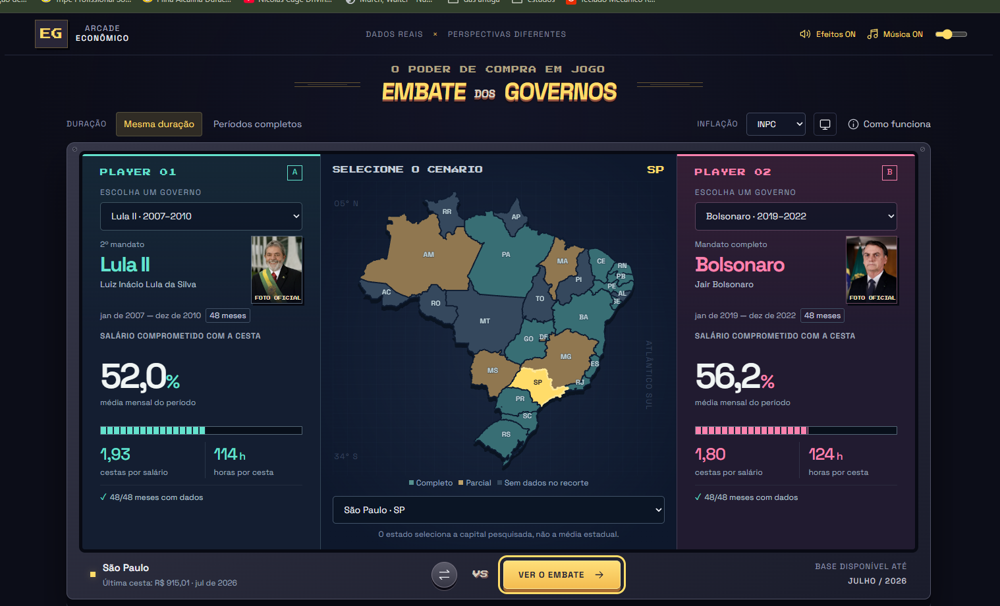

<div align="center">

#  Embate dos Governos

### Cesta básica, salário mínimo e poder de compra em uma arena de comparação

Uma ferramenta interativa para comparar períodos presidenciais brasileiros a partir de dados econômicos reais, com recortes por capital, inflação, evolução da cesta básica e ganho real do salário mínimo.

[](https://vercel.com/new/clone?repository-url=https://github.com/LilLemo/embate-dos-governos-final)

</div>



## Sobre o projeto

O **Embate dos Governos** transforma séries econômicas extensas em uma experiência visual inspirada em jogos de luta dos anos 1990.

O usuário escolhe dois períodos presidenciais, uma capital e um índice de inflação. A ferramenta calcula os indicadores, mostra a evolução ao longo do tempo, abre os alimentos da cesta básica e apresenta um placar com os critérios vencidos por cada lado.

O projeto não utiliza inteligência artificial para interpretar os resultados. Toda análise é produzida por regras matemáticas transparentes e executada diretamente no navegador.

<div align="center">
  
</div>

## O que é possível analisar

| Indicador | O que representa | Como o round é decidido |
|---|---|---|
| Cesta no salário | Percentual médio do salário mínimo comprometido pela cesta básica | Menor percentual vence |
| Cestas por salário | Quantidade de cestas que cabem em um salário mínimo | Maior quantidade indica mais poder de compra |
| Horas para a cesta | Jornada equivalente necessária para comprar uma cesta | Menor quantidade de horas indica menor esforço |
| Salário real | Reajuste do salário descontada a inflação do período | Maior ganho real vence |
| Evolução da cesta | Mudança do peso da cesta no salário entre o início e o fim do recorte | Menor mudança em pontos percentuais vence |
| Alimentos | Peso individual de carne, arroz, feijão, leite e outros itens | Comparação visual entre os períodos |

## Principais recursos

- Comparação entre períodos presidenciais de FHC, Lula, Dilma, Temer e Bolsonaro.
- Lula III contra Bolsonaro como confronto inicial.
- Seleção das capitais pelo mapa do Brasil.
- Agregado nacional baseado em uma amostra fixa de capitais completas.
- Comparação equivalente, usando a mesma duração nos dois lados.
- Alternância entre INPC e IPCA.
- Evolução mensal da cesta básica e do poder de compra.
- Detalhamento por alimento.
- Indicadores de cobertura e lacunas das bases.
- Destaque específico para séries incompletas, como Boa Vista.
- Exportação das análises em CSV.
- Música e efeitos sonoros opcionais.
- Interface responsiva e funcionamento inteiramente estático.

## Cobertura dos dados

A base tratada reúne:

- 27 capitais brasileiras e Macaé.
- 6.783 observações mensais.
- Valores da cesta básica e de seus componentes.
- Histórico do salário mínimo federal.
- Séries mensais do INPC e do IPCA.
- Dados disponíveis até julho de 2026.

Agosto de 2026 aparece em algumas exportações originais, mas sem valores preenchidos para todas as localidades. Por isso, julho de 2026 permanece como a última competência válida da versão publicada.

As lacunas não são preenchidas com zero. Médias de cesta só são exibidas quando todos os meses do recorte possuem dados.

## Como funciona o placar

Cada embate utiliza três critérios independentes:

1. Menor comprometimento médio do salário com a cesta.
2. Maior ganho real do salário mínimo.
3. Menor evolução do peso da cesta no salário.

Cada critério válido vale um ponto. Cestas por salário, horas necessárias e percentual comprometido descrevem a mesma relação matemática e, portanto, formam uma única rodada.

O placar descreve apenas os indicadores, a capital e os períodos selecionados. Ele não atribui causalidade econômica a uma única pessoa ou governo.

## Comparação equivalente e períodos inteiros

**Comparação equivalente**, opção recomendada, usa nos dois lados a duração do período mais curto, sempre a partir do primeiro mês. Isso evita comparar diretamente um governo de 16 meses com outro de 48 meses.

**Períodos inteiros** preserva todos os meses disponíveis de cada lado. É útil para conhecer a trajetória completa, mas pode colocar durações diferentes frente a frente.

## Fórmula do ganho real

O ganho real compara a evolução do salário com a inflação acumulada no mesmo intervalo:

```text
ganho real = (salário final / salário de referência)
             / (índice final / índice de referência) - 1
```

O INPC é o padrão do projeto por acompanhar famílias assalariadas de 1 a 5 salários mínimos. O IPCA fica disponível como referência ampla, cobrindo famílias de 1 a 40 salários mínimos.

## Fontes

- [DIEESE: Pesquisa Nacional da Cesta Básica de Alimentos](https://www.dieese.org.br/cesta/)
- [Ipeadata: salário mínimo nominal](https://www.ipeadata.gov.br/ExibeSerie.aspx?serid=1739471028)
- [Banco Central: INPC, série 188](https://api.bcb.gov.br/dados/serie/bcdata.sgs.188/dados?formato=json)
- [Banco Central: IPCA, série 433](https://api.bcb.gov.br/dados/serie/bcdata.sgs.433/dados?formato=json)
- [IBGE: malha geográfica do Brasil](https://servicodados.ibge.gov.br/api/v3/malhas/paises/BR)
- Retratos oficiais preservados localmente a partir de arquivos do Wikimedia Commons.

## Estrutura do projeto

```text
dist/
├── index.html          Página principal
├── app.js              Interface e interações
├── engine.js           Motor de cálculo
├── data.json           Base tratada
├── style.css           Identidade visual e responsividade
├── fonts/              Fontes locais
└── portraits/          Retratos presidenciais

scripts/
├── prepare_data.py     Preparação das exportações
├── engine.test.mjs     Testes do motor
└── sources/            Snapshots de salário, INPC e IPCA
```

As planilhas brutas do DIEESE não ficam versionadas no repositório público. A aplicação utiliza apenas a base tratada em `dist/data.json`.

## Executar localmente

O projeto precisa ser servido por HTTP porque carrega módulos JavaScript e o arquivo de dados separadamente.

```bash
python -m http.server 8000 --directory dist
```

Depois, abra `http://localhost:8000`.

Para validar o motor de cálculo:

```bash
node --test scripts/engine.test.mjs
```

## Publicar na Vercel

O repositório já inclui o `vercel.json` apontando para a pasta `dist`.

1. Importe este repositório na Vercel.
2. Selecione **Other** como framework.
3. Deixe o comando de build vazio.
4. Confirme a publicação.

Também é possível usar o botão **Deploy with Vercel** no início deste README.

## Tecnologias

- HTML5
- CSS3
- JavaScript ES Modules
- SVG
- Python para tratamento dos dados
- Node.js Test Runner para validações

## Observação metodológica

Os resultados são comparações descritivas. Crises internacionais, políticas estaduais, condições herdadas, sazonalidade e outros fatores externos podem afetar os indicadores. A associação dos meses a um governo organiza o recorte temporal, mas não comprova causalidade.

---

<div align="center">

Desenvolvido por **Leonardo Moura** como projeto de portfólio em dados, tecnologia e transformação de processos.

</div>
